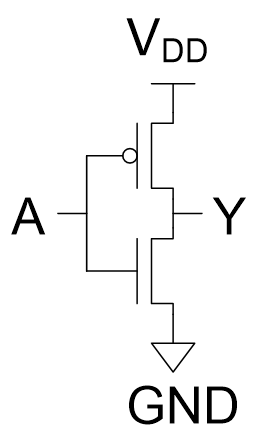
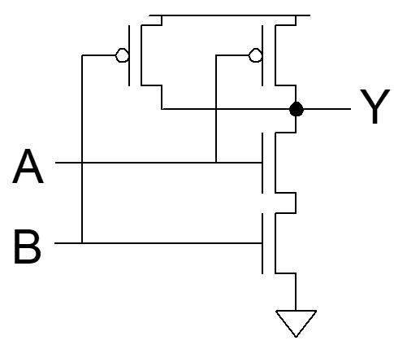
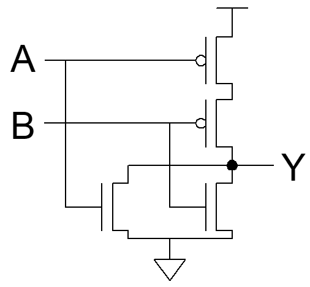

# 반도체 Physical Design to Custom Compiler

## CMOS

### 개요

- **One Chip 구성 요소**  
  - 수동 소자 (저항, 커패시터 등)  
  - 능동 소자 (트랜지스터 등)  
  - 배선 (wire)  
  - 기판 (substrate)  

- **장점**  
  - 집적도 향상 → 가격 절감, 전력 효율, 성능(속도) 향상  
  - 경제성 및 경쟁력 확보

- **VLSI (Very Large Scale Integration)**  
  - 수십만 개 이상의 트랜지스터를 집적한 칩  
  - 예: CPU, GPU, ASIC, FPGA 등  

---

### CMOS (Complementary Metal-Oxide-Semiconductor)

- **정의**  
  N형(NMOS)과 P형(PMOS) 트랜지스터를 조합하여 논리 회로 구성

- **전하 이동 특성**  
  - 정공보다 전자의 이동 속도가 **2배 이상 빠름**  
  - 따라서 PMOS는 동일한 전류를 흐르게 하려면 **NMOS보다 Width를 2배로 설정**  
    → 전류 균형 맞춤

---

### CMOS 트랜지스터 구조

- **공통 구성 요소**  
  - Gate  
  - Source  
  - Drain  
  - Body

- **NMOS (N-Channel, NPN)**  
  - Gate: 5V  
  - Drain: 5V  
  - Source: 0V  
  - Body: 0V  

- **PMOS (P-Channel, PNP)**  
  - Source: 5V  
  - Body: 5V  
  - Gate: 0V  
  - Drain: 0V  

- **Body와 Source 연결 (3단자 회로 구성)**  
  - 일반적으로 Body는 Source에 연결  
  - 이유: Body 효과 최소화 및 기준 전압 유지

---

### 기본 논리소자

#### 1. 인버터 (Inverter)

---

#### 2. NAND

---

#### 3. NOR

---

